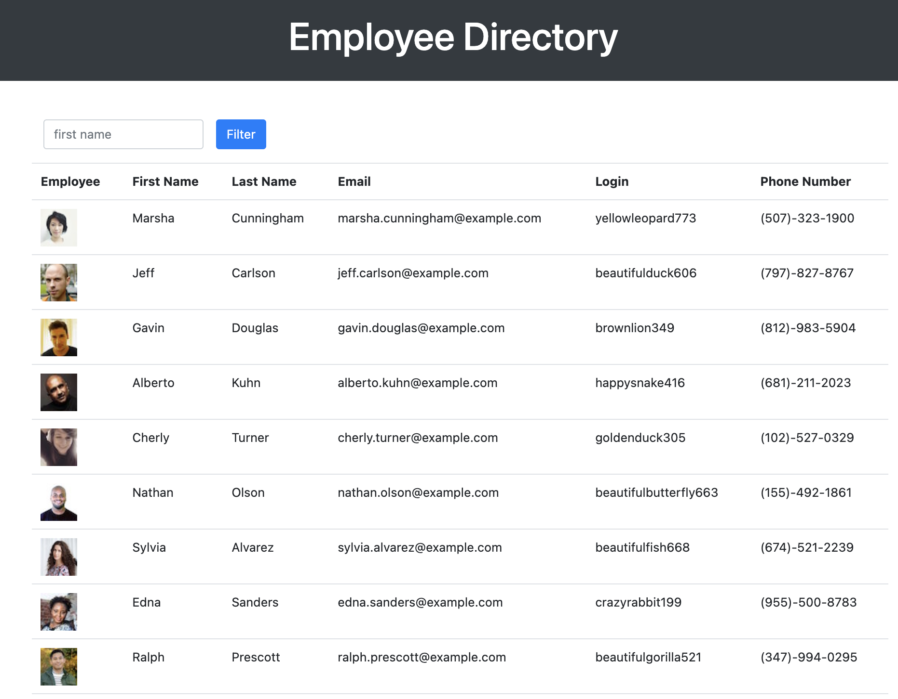

# Employee Directory

  ## Table of Contents

  * [Description](#description)
  * [Installation](#installation)  
  * [Deployed-Link](#deployed-link)
  * [Technologies-Used](#technologies-used)
  * [Usage](#usage)
  * [Images](#images)
  * [Questions/Contributions](#questions/contributions)
  * [License](#license)

  ## Description

  The motivation for this project was the desire to create a single page application using React. This application uses React components in order to break up the applications functionality and UI. This application also manages state and responds to user events. 
  
  The purpose of this application is to be able to view an employee directory in a table, and then be able to sort that directory by a specific column, and also filter by an employee's first name.

  ## Installation

  No prior installation is required to use this application. The deployed link for the application is provided below.

 
  ## Deployed-Link

  [Employee Directory](https://martinmondaca.github.io/Employee_Directory/)
  
## Technologies-Used

  * [React](https://reactjs.org/)
  * [Random User Generator](https://randomuser.me/)
  * [Node.js](https://nodejs.org/en/)
  * [Bootstrap](https://getbootstrap.com/)
  * [axios](https://www.npmjs.com/package/axios)

  ## Usage
  
1. Upon loading the application you will be presented with 50 employees.
1. You can click on each column header in order to sort employees by first name, last name, email, login, or phone number.
1. You can also filter employees by first name.
    * Enter the employee's first name or part of their first name in the search field and click the 'Filter' button.
1. You can also sort employees and filter by first name at the same time.

  ## Images

### Screenshot of application

  

  ## Questions/Contributions

  If you have any questions or if you would like to contribute to this project you can reach me at martin7mondaca@gmail.com or via my GitHub [martinmondaca](https://github.com/martinmondaca)

  ## License

  Licensed under [MIT](https://choosealicense.com/licenses/mit/) license.